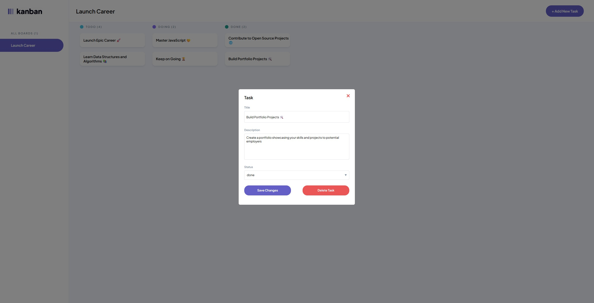

# JSL05 Project: Task Board with Local Storage Persistence and Task Creation

## Project Description

This project is a task management system where **tasks are persisted in local storage**, ensuring that tasks remain available even after refreshing the page or reopening the application. Users will be able to **add new tasks**, with the task details being **stored in local storage** and displayed in the appropriate **columns** ("To Do", "Doing", "Done"). The application also includes an **Add Task** modal for creating new tasks.

## Setup Instructions

1. Clone or download this repo
2. If downloaded, extract files and open index.html either in VSCode or straight in your browser
3. If opened in VSCode, use the Live Server extension to view the web page
4. Tasks will show up dynamically and you can click them to view their information
5. Add new tasks with the **NEW** Add Task button!

## Technologies Used

- HTML
- CSS
- JavaScript

## Features

- Dynamic task display, based on a given set of data
- Clickable tasks
- When clicked, tasks will display a modal with all relevant task information
- Task information is editable, but will not save **yet**
- **+ Add New Task** button can be clicked to open a modal where you can input information for a new task
- Can click **Create Task** to save the task and it will be displayed on the webpage
- Add New Task modal has form validation, so you won't be able to submit with blank inputs
- Initial tasks and any added tasks will be save to local storage, so will persist across refreshes
- Tasks can be deleted if required

## Usage Examples

- Dynamically displaying a list of tasks
- Adding new tasks to the task board
- Keeping track of tasks and viewing their information when clicked

  

  

## Usage instructions

- Tasks will show up dynamically based on a given set of data
- Once loaded, you can click a task to view its information
- You can change the tasks information through the pop-up (however, it will not be saved once the pop-up is closed)
- Close the pop-up by clicking the red 'X' in the top right corner
- Click the **+ Add New Task** button to enter new task data and then create the task to save it to the task board
- Try refreshing the page to see if your new task is still there
- If you are no longer a fan of your new task, or any of the other tasks, pressing the delete button in the task pop-up will remove it

## Key Objectives

### Persistent Task Storage & Retrieval

- **Save tasks to local storage**: On page load, the application should **load tasks** from local storage so that the latest task list is available, even after a refresh.
- Ensure that **tasks are saved in local storage** every time a new task is added so that tasks persist after the page refreshes.
- **Load tasks** from local storage on startup, so users can see the latest tasks without manually re-entering them.
- Tasks should be categorized correctly into their respective columns (e.g., "To Do", "Doing", "Done") based on their **status** when loaded from local storage.

### Task Creation & Modal Interaction

- Provide an **"Add Task" button** that, when clicked, opens a **modal** for creating a new task.
- The modal should include:
  - Fields for entering the **task title** and **description**.
  - A dropdown to select the task **status** ("To Do", "Doing", "Done").
  - A **submit button** to add the new task to the task board immediately.
- After submitting, the task should appear on the board without requiring a page refresh.

## Design & Responsiveness

- The **"Add New Task" modal** should match the [Figma design](https://www.figma.com/design/y7bFCUYL5ZHfPeojACBXg2/Challenges-%7C-JSL?node-id=0-1&p=f&t=NNqgDPlU1PNLLh8i-0), including mobile-responsive behaviour.
- Ensure that the modal and task board are **fully responsive** and function properly on both desktop and mobile devices.
- The "Add Task" button should **transform** appropriately on mobile devices to match the Figma design.

## Code Structure & Maintainability

- **Modularize your JavaScript code**: Break your code into separate modules, each handling a **single responsibility** (e.g., local storage handling, task rendering, modal management).
- Use **descriptive variable and function names** to ensure the code is clear and easy to maintain.
- Include **JSDoc comments** for every major function and module to describe their functionality, parameters, and return values.

## Expected Outcome

A fully functional task management system where tasks are dynamically loaded from **local storage**, tasks can be **added through a modal**, and the application **remains consistent** after refreshing the page. The code will be modular, well-documented, and easy to maintain, following best practices for JavaScript development.
